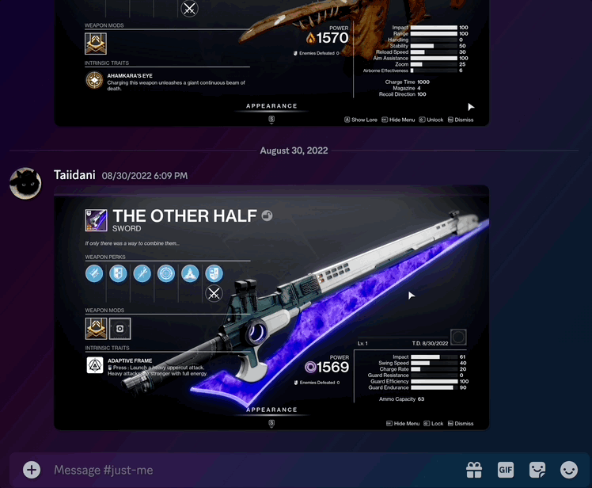

# No Time To Explain Bot

URL: https://ptb.discord.com/api/oauth2/authorize?client_id=1216152057862426694&permissions=2147485696&scope=bot%20applications.commands

Permissions:
* Text - Send Messages
* Text - Use Slash Commands

## Usage

1. In any channel, write "/time". This will post a timestamp message for the current time (default `EDT` timezone) that only you can see.
1. Click the "Change Time" button, which will let you modify the timestamp to match your desired time.
1. Select one of the available timestamp formats by hovering over the Discord tag (e.g. `<t:1710605220:T>`) and clicking the copy button that appears.
1. Paste the Discord tag in any message wanting to reference that exact point in time. All readers will see the time according to their local timezones.
1. Dismiss or reuse the message whenever you like!



## Testing

This bot may be tested locally provided that you have a DISCORD_TOKEN environment variable set to a valid Discord token. You may manage your own token by creating an App at https://ptb.discord.com/developers/applications which will allow you to develop new features independently of the hosted bot (e.g. "production").

```sh
export DISCORD_TOKEN=xxxtokenxxx
go run main.go
```

Alternatively if you need to develop against the bot directly, coordinate with the repository owner(s) and we can shutdown the existing bot and distribute its token to you.


### Persistence

By default the application runs with a memory-backed persistence layer. If you need to test the Redis persistence options you may point the application at a local Redis instance:

```sh
docker-compose up -d
REDIS_ADDR=127.0.0.1:6379 go run main.go
```
